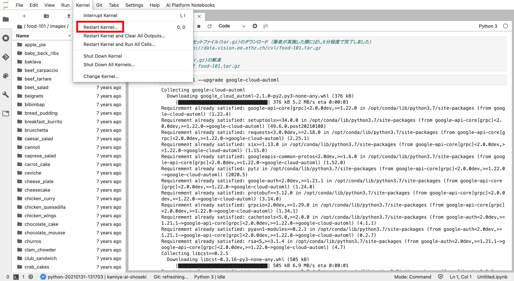
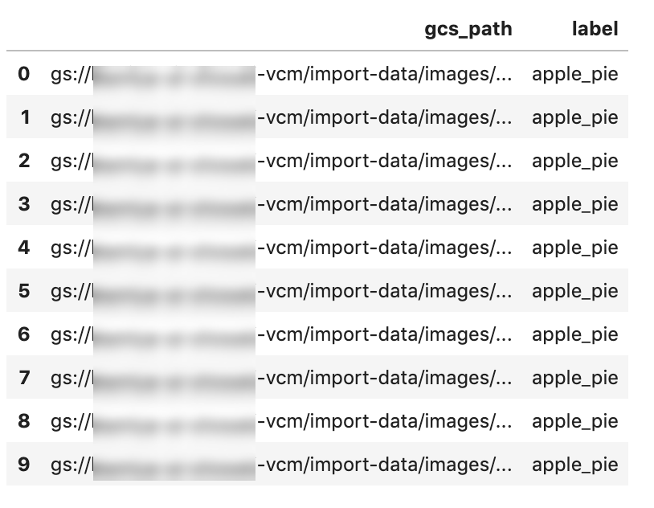
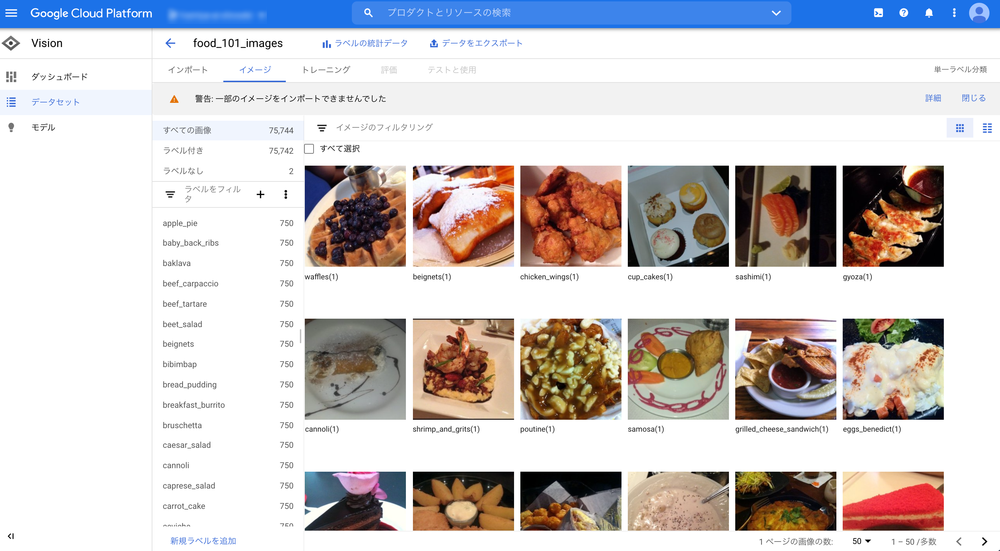

## [付録] AutoML Vision のデータセット作成方法

<!-- TOC -->

- [[付録] AutoML Vision のデータセット作成方法](#付録-automl-vision-のデータセット作成方法)
    - [1. 準備作業](#1-準備作業)
    - [2. 画像のダウンロードと解凍](#2-画像のダウンロードと解凍)
    - [3. AutoMLのクライアントライブラリのインポート](#3-automlのクライアントライブラリのインポート)
    - [4. AutoMLデータセットの作成](#4-automlデータセットの作成)
    - [5. データインポート用のメタデータファイルの作成](#5-データインポート用のメタデータファイルの作成)
    - [6. AutoMLからメタデータファイルの読み込み](#6-automlからメタデータファイルの読み込み)

<!-- /TOC -->

### 1. 準備作業

作業前に以下を実行しておきます。

- AutoML APIの有効化
- GCSバケット（データ格納用）の作成

### 2. 画像のダウンロードと解凍

インターネットで公開されている「Food-101」は5GBのtar.gzファイルです。通信環境によってはローカルマシンへのダウンロードに相当の時間がかかってしまいます。今回は「[AI Platform Notebooks](https://cloud.google.com/ai-platform-notebooks/?hl=ja)」を使ってJupyterノートブック上で一連の作業をしてみる事にします。これによって、ローカルPCにファイルをダウンロードすることなく、クラウド上で作業が実施できます。（[AI Platform Notebooks](https://cloud.google.com/ai-platform-notebooks/?hl=ja)については「5-2-1. AI Platform Notebooks」を参照してください）

```python
#画像データセットファイル（tar.gz）のダウンロード （筆者が実施した際には5,6分程度で完了しました）
!wget http://data.vision.ee.ethz.ch/cvl/food-101.tar.gz

#ファイル（tar.gz）の解凍
!tar -zxvf food-101.tar.gz
```

### 3. AutoMLのクライアントライブラリのインポート

AutoMLではGUI上からの画面操作による画像インポート以外にも、REST-APIやPythonなどのプログラミング言語でのインポートもサポートしています。今回はGCPが公開しているPythonのクライアントライブラリを使ってみます。

```python
#AutoMLのライブラリをインストール
!pip install --upgrade google-cloud-automl
```

AutoMLのライブラリをインストールした後、クレデンシャルを有効化するために、「Restart Kernel」でJupyterのカーネルを再起動します。カーネルとは、「独立して実行され、Jupyterアプリケーションとそのユーザーインターフェイスとで相互作用するプログラミング言語固有のプロセス」[5]のことを指します。




### 4. AutoMLデータセットの作成

その後、AutoMLでのデータセット名や、データセットの目的（`image_classification_dataset_metadata`：画像分類 ）、分類の種類（マルチラベルorマルチクラス。今回はマルチクラスなので `False` ）を設定し、`create_dataset` 関数によってデータセットを作成します。

```python
from google.cloud import automl

#AutoMLで使用するGCPのプロジェクトIDやリージョン、データセット名を設定
project_id = 'your-project-id'
compute_region = 'us-central1'
dataset_name = f'food_101_images'

#分類の種類を設定
multilabel = False
classification_type = "MULTICLASS"
if multilabel:
    classification_type = "MULTILABEL"

#ロケーションを設定
project_location = f"projects/{project_id}/locations/{compute_region}"

#データセットのconfigを設定
metadata = {"classification_type": classification_type}
dataset = automl.Dataset(
        display_name=dataset_name,
        image_classification_dataset_metadata=metadata,
)

#データセットを作成
client = automl.AutoMlClient()
response = client.create_dataset(parent=project_location, dataset=dataset)

#返却値から作成したデータセットの情報を確認
dataset = response.result()
print(f"Dataset name: {dataset.name}")
print(f"Dataset id: {dataset.name.split('/')[-1]}")
```

`create_dataset` 関数 の返却値からデータセットの情報を確認する事ができます。

### 5. データインポート用のメタデータファイルの作成

上記によって空のデータセットの作成が済んだので、実際に画像データをインポートしてみます。
AutoMLでは、データインポートの際に以下のようなメタデータファイル（CSV形式）を用意する必要があります。

```python
"Google Cloud Storageへのパス","ラベル"
gs://your-project-id/flower100080576_f52e8ee070_n.jpg,daisy
gs://your-project-id/flower100080576_f52e8ee071_n.jpg,daisy
gs://your-project-id/flower100080576_f52e8ee072_n.jpg,sunflower
```

上記の構成となるように、`food-101` のメタデータを加工します。
注意点として、AutoMLを有効化した場合、Google Cloud Storageに専用のバケット（例：`gs://{project_id}-vcm`）が作成されます。メタデータファイルと画像の物理ファイルは全てこのバケット配下に配置する必要があります。

```python
#データセットのメタデータ作成
AUTO_ML_DATASET_IMAGES_DIR=f"gs://{project_id}-vcm/import-dat"
AUTO_ML_DATASET_METADATA_DIR=f"gs://{project_id}-vcm/import-data/metadata/"
AUTO_ML_DATASET_METADATA_FILE_NAME="food-101-automl-data.csv"

import pandas as pd
train_data = pd.read_csv("food-101/meta/train.txt", names=["path"])

#ファイルパスからラベル名を抽出
def get_label(col):
    return col.split("/")[0]

train_data["label"] = train_data["path"].apply(get_label)
train_data["gcs_path"] = AUTO_ML_DATASET_IMAGES_DIR + train_data["path"] + ".jpg"
train_data_ = train_data[["gcs_path", "label"]]
train_data_.head(10)
```




メタデータファイル（`food-101-automl-data.csv`）と画像の物理ファイルをそれぞれGoogle Cloud Storageに配置します。（メタデータに記載の `gcs_path` とコピーする物理ファイルが対応するようにしてください）

```python
#CSVに出力
train_data_.to_csv(AUTO_ML_DATASET_METADATA_FILE_NAME, header=False, index=False)

#GCSにメタデータファイルと画像をコピー
!gsutil cp {AUTO_ML_DATASET_METADATA_FILE_NAME} {AUTO_ML_DATASET_METADATA_DIR}
!gsutil -m cp -r food-10* {AUTO_ML_DATASET_IMAGES_DIR}
```

### 6. AutoMLからメタデータファイルの読み込み

メタデータファイルと画像の物理ファイルが適切にGCSに配置されました。AutoMLにメタデータファイルをロードし、画像データを読み込ませてみましょう。

```python
dataset_id = dataset.name.split("/")[-1]
path = AUTO_ML_DATASET_METADATA_DIR + AUTO_ML_DATASET_METADATA_FILE_NAME

dataset_full_id = client.dataset_path(
    project_id, compute_region, dataset_id
)

input_uris = path.split(",")
input_config = {"gcs_source": {"input_uris": input_uris}}

response = client.import_data(dataset_full_id, input_config)

print("Processing import...")
print("Data imported. {}".format(response.result()))
```

プログラムからの画像の読み込みが完了しました。実際にAutoMLのコンソールからデータがインポートされた事を確認します。



「警告: 一部のイメージをインポートできませんでした」と出ていますが、これはFood-101のデータエラーによるものです。筆者が確認した限りでは、全く同じ画像なのにファイル名だけ異なるものが存在していました。こういった重複データは精度に影響を与えますが、これらを自動排除するバリデーション機能もAutoMLは備えています。学習データに関する制約はGCPのリファレンス[2]に載っているので、データ準備の際にはこちらを一読されることをオススメします。 -->
